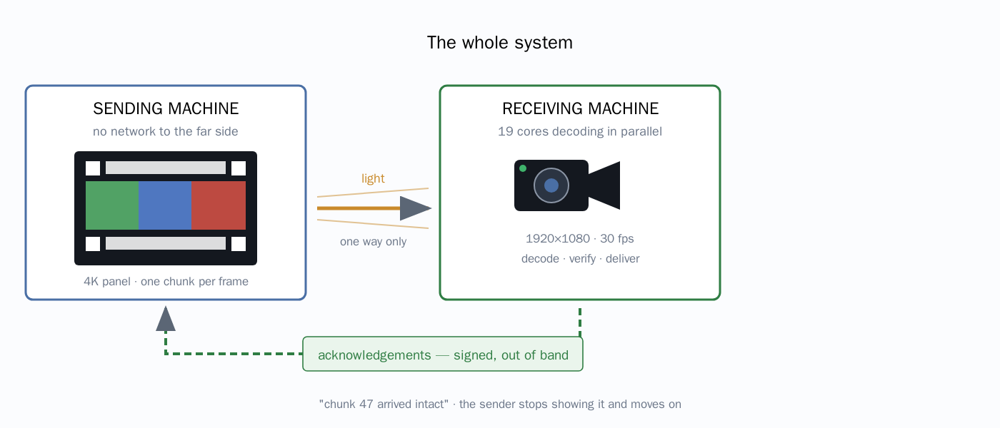

# Optical Transport Platform

Move large files across an air gap with a monitor and a camera. The sender draws a file as encoded frames
on a display; the receiver photographs them, rebuilds the file, and checks it against a hash the sender
declared before anything was drawn.



**Acknowledgements travel out of band, never optically.** That is the whole design. Light goes one way, and
a frame lost to a flicker produces no error — only silence — so the sender never waits for bad news. It
waits for good news over a separate channel, and does not move on without it.

**[See a transfer end to end, with screenshots →](docs/DEMONSTRATION.md)** ·
**[Technical overview (PDF) →](docs/optical-transport-overview.pdf)**

---

## Quick start

Nothing to install but Docker.

```bash
cd sender   && cp .env.example .env   # set OTP_SENDER_ACK_SECRET
docker compose up -d                  # UI on :8080

cd ../receiver && cp .env.example .env  # the same ack secret
docker compose up -d                    # UI on :8081
```

Send a file:

```bash
curl -X POST http://localhost:8080/api/v1/transfers \
    -F "file=@quarterly-report.tar" \
    -F "callback_url=https://intake.example.com/received"
```

To watch the whole path on one machine, [`demo/docker-compose.yml`](demo/docker-compose.yml) runs both
sides plus a callback endpoint.

## Transfer speed

Throughput is **bytes per frame × frames per second**. Bigger grids carry more per frame; the panel sets
how many frames a second.

**Capacity per frame, measured** — `color16` is four bits per cell, `color8` is three:

| Grid | Frame size<br>at 4 px cells | `color8` | `color16` | Best for |
|---|---|---|---|---|
| **256×256** | 1 040 px | 22 669 B | **30 226 B** | 1080p panel, any camera |
| **384×384** | 1 552 px | 52 716 B | **70 288 B** | 4K panel — **the measured sweet spot** |
| **512×512** | 2 064 px | 94 860 B | **126 480 B** | 4K panel + 4K camera, for the largest files |

**What that means in throughput**, `color16`:

| Grid | 25 fps | 40 fps | 60 fps | 1 GB takes |
|---|---|---|---|---|
| 256×256 | 738 KB/s | 1.15 MB/s | 1.73 MB/s | 10 min at 60 fps |
| **384×384** | **1.68 MB/s** | 2.68 MB/s | 4.02 MB/s | 4 min at 60 fps |
| **512×512** | 3.02 MB/s | 4.82 MB/s | **7.24 MB/s** | **2.4 min at 60 fps** |

**Measured end to end**, 8 MB of incompressible data, verified and delivered:

| Configuration | Offered | **Achieved** | Losses |
|---|---|---|---|
| 256×256 @ 8 px, 40 fps | 1.15 MB/s | 730 KiB/s | none |
| **384×384 @ 5 px, 25 fps** | 1.68 MB/s | **1.45 MB/s** | none |

**Prefer fewer, larger frames.** Twice the throughput at less than two-thirds the frame rate — every frame
costs the same fixed overhead whatever it carries, so larger frames amortise it.

### The ceiling: the receiver, not the display

Decoding costs **85–115 KB/s per CPU core**, and that barely changes with geometry. Your core count sets
the limit:

```
frames per second  =  cores × 115 000 ÷ bytes per frame
```

| Cores | Sustainable | Reality |
|---|---|---|
| 4 | 460 KB/s | A laptop |
| 19 | **2.2 MB/s** | The 20-core workstation everything here was measured on |
| 64 | 7.2 MB/s | No ordinary machine — **use several channels instead** |

**7 MB/s is a multi-channel target.** Four screen–camera pairs at 1.8 MB/s each, carrying disjoint ranges
of chunks of one file. The foundations exist — chunks are addressed by number, the database claims work
atomically, acknowledgements are per chunk — but the range-claiming display loop is **designed and not yet
built** ([overview](docs/optical-transport-overview.pdf), §8).

## Hardware you need

| | Up to ~1.5 MB/s | For 7 MB/s |
|---|---|---|
| Grid | 384×384 @ 5 px | 512×512 @ 4 px |
| Panel | One 4K, 30 Hz | Four 4K, 60 Hz |
| **Camera** | **1080p is enough**<br><span title="388 cells across a 1080px sensor">2.78 sensor px per cell</span> | **4K required**<br>1080p gives only 2.09 px per cell — no margin for blur |
| Camera rate | ≥ 2× the display | ≥ 60 fps, MJPG, global shutter preferred |
| Receiver | 1 machine, ~19 cores | 4 machines, ~19 cores each |
| Blur budget | 1.0 px | **0.8 px** — the tightest constraint in the whole setup |

## Where to watch it

| URL | What it shows |
|---|---|
| `<sender>/display?camera=1` | **Point the camera here.** Full screen, black surround, nothing else |
| `<sender>/settings` | Frame rate and geometry. The panel's refresh rate is measured in your browser |
| `<sender>/transfers/<id>` | Chunk map, the file as sent, every frame as an image, Pause / Stop |
| `<receiver>/` | Live capture — frames arriving as thumbnails, labelled by chunk |
| `<receiver>/transmissions/<id>` | The file itself, both hashes side by side, where it was delivered |
| `<receiver>/settings` | Start / stop the camera, choose which one |

Two details on the display page are load-bearing rather than cosmetic: **scaling is whole multiples only**
and **smoothing is off**. The decoder takes the median of each cell's pixels, so fractional scaling blends
cells into their neighbours, and the browser's default filter is a blur — which is exactly what the optical
budget reserves for the lens.

## Cameras

Three ways to capture, all feeding the same pipeline:

- **`browser`** — the page holds the camera via `getUserMedia`. This is the one that **asks permission** and
  shows the operating system's indicator, and it works from a phone. Needs HTTPS: browsers will not give a
  camera to an insecure page, and `localhost` is the only exception.
- **`camera`** — the receiver opens a V4L2 device directly. No OpenCV, no cgo. Fastest, and needs the device
  passed into the container.
- **`file`** — reads a directory the sender's display writes into. No camera at all, for development.

A camera configures itself: the lowest-numbered device that actually declares video capture, in its largest
mode. It keeps watching, so one plugged in later is noticed — but it never overrides a choice you made.

## Testing

```bash
make test
```

Everything runs in containers — Go toolchain, both databases, MinIO. A clone plus Docker is enough.

| Suite | Covers |
|---|---|
| [`shared`](shared) | Protocol, five encodings against simulated optics, five compressors, four error-correcting codes, RFC 6330 conformance |
| [`sender`](sender) | Configuration, migrations, the job engine under concurrency, object stores, the pipeline |
| [`receiver`](receiver) | Camera enumeration, capture sources, decoding, object stores |
| [`e2e`](e2e) | Both applications together: loss, degradation, encryption, every encoding, callback success and failure |

## How it is put together

```
shared/     Protocol only: frame format, encodings, compression, error correction. No DB, no HTTP.
sender/     Go + React. Compresses, chunks, codes, renders, displays, watches for acknowledgements.
receiver/   Go + React. Captures, decodes, acknowledges, merges, verifies, delivers.
e2e/        Runs both together. Imports each side's harness, never their internals.
```

The two applications **do not import each other**. They share a protocol, a directory, and nothing else —
which is what lets either be restarted, upgraded or replaced while the other keeps running.

## Documentation

- [A transfer, end to end](docs/DEMONSTRATION.md) — screenshots of the whole path
- [Technical overview (PDF)](docs/optical-transport-overview.pdf) — twelve pages for a
  non-specialist reader: the setup, speed at each end, what a chunk is, how acknowledgement works, and how
  it would scale out
- [Optimal configuration](docs/OPTIMAL-CONFIG.md) — every measured figure and what to set

## Security notes

- **Neither API authenticates yet.** Anyone who can reach the sender can upload a file or change the
  geometry; anyone who can reach the receiver can start a camera. Put authentication in front of them
  before exposing either.
- **Both secrets have no defaults.** A default signing secret is not a secret, and the acknowledgement
  channel is the one input the sender takes from outside itself.
- **Callback URLs are allowlisted, redirects not followed.** The URL crosses the gap from outside the
  receiver's trust boundary; without a list the receiver would be a request-forgery proxy.
- **Nothing unverified is delivered or served.** A merged file failing its hash is kept as evidence and
  refused.
- **A transferred file is never served as something a browser executes.** One allowlist
  ([`shared/mediatype`](shared/mediatype/mediatype.go)) governs both ends. **SVG is excluded** — it looks
  like an image and is an XML document that may carry `<script>`.
- **Decompression is bounded by the manifest's declared size.** Every codec here can express a small input
  that expands without limit.
