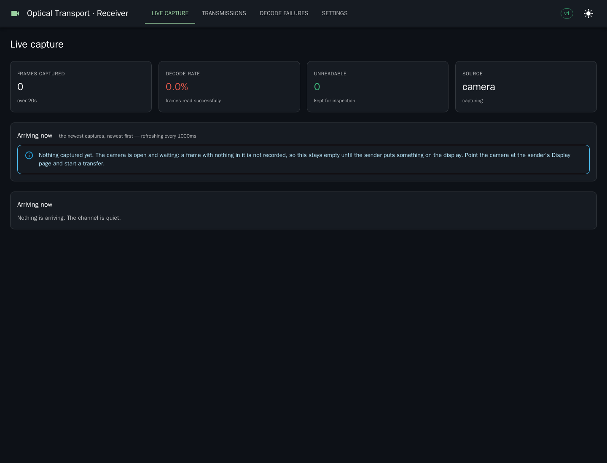

# Optical Transport Platform

Move large files across an air gap with a monitor and a camera. The sender draws a file as encoded frames
on a display; the receiver photographs them, rebuilds the file, and checks it against a hash the sender
declared before anything was drawn.


**Acknowledgements travel out of band, never optically.** That is the whole design. Light goes one way, and
a frame lost to a flicker produces no error — only silence — so the sender never waits for bad news. It
waits for good news over a separate channel, and does not move on without it.

A chunk is displayed repeatedly until a signed acknowledgement for it arrives. Nothing else promises
delivery; error correction is an optimisation on top, not the guarantee.

**[See a transfer end to end, with screenshots →](docs/DEMONSTRATION.md)** ·
**[Technical overview (PDF) →](docs/optical-transport-overview.pdf)**

---

## Quick start

Nothing to install but Docker.

```bash
cd sender   && cp .env.example .env   # set OTP_SENDER_ACK_SECRET
docker compose up -d                  # UI on :8080

cd ../receiver && cp .env.example .env  # the same ack secret
docker compose up -d                    # UI on :8081
```

Send a file:

```bash
curl -X POST http://localhost:8080/api/v1/transfers \
    -F "file=@quarterly-report.tar" \
    -F "callback_url=https://intake.example.com/received"
```

Both sides need one directory in common — an NFS mount, a SAN, or a synced share. Frames go one way
through it; acknowledgements come back the other.

The form asks for a file and nothing else. Everything the curl example cannot express — the callback,
encoding, compression, error correction, encryption, and the geometry — is behind **Advanced**, closed by
default, because the defaults are the measured ones and most transfers should not touch them.

Inside it, **grid and cell size are both per transfer**: presets from 64×64 to 512×512, cells of 1 to 8
pixels, and either can be left on **"Auto — fit my screen,"** computed in your browser from the space the
Display page will actually give a frame — the panel less the browser's own furniture, less the room the page
keeps for its caption, divided between the lanes.

Only grids that screen can show are offered. One that cannot be displayed at any offered cell size renders a
frame the Display page pins at 1× and hangs off the edge, since it scales by whole numbers and will not
resample a cell across a fractional boundary to make it fit.

Fixing the grid sizes the cell for it, and *not* by taking the largest that fits — that is usually the
smaller picture as well as the slower one. An 80-cell grid at 8 px renders 672 and is shown at 672 on a 1080
panel, because twice 672 does not fit; at 4 px it renders 336 and is shown at 1008. Same picture to a camera,
a quarter of the pixels to draw and compress. Leaving both on Auto takes the largest grid the encoding can
still be read at, then sizes its cell the same way. The deployment-wide values in `.env` remain the
default for any transfer that does not choose.

## What it looks like

<table>
<tr>
<td width="50%"><br><sub><b>Send</b> — a file and a callback, everything else defaulted to a measured setting.</sub></td>
<td width="50%"><br><sub><b>Display</b> — one frame at a time, scaled by a whole number so no cell is resampled.</sub></td>
</tr>
<tr>
<td><br><sub><b>Receiving</b> — frames as they arrive, each one clickable for what happened to it.</sub></td>
<td><br><sub><b>Aiming</b> — the aiming display grades the shot and says which way to move.</sub></td>
</tr>
<tr>
<td><br><sub><b>A frame</b> — fiducials, timing columns, header and footer bands, colour payload.</sub></td>
<td><br><sub><b>A real capture</b> — blurred, off-square, unevenly lit, and still readable.</sub></td>
</tr>
</table>

More in [a transfer, end to end](docs/DEMONSTRATION.md).

## What it does, and where the detail lives

The README stopped being readable somewhere past six hundred lines, so the long-form explanation moved into
documents beside it. Each one is a topic an operator actually goes looking for, rather than a chapter of a
manual nobody reads front to back.

| | |
|---|---|
| **[The channel](docs/channel.md)** | The three ways frames cross the gap — a shared directory, a display and a camera, or paper — and how to aim a camera at one. |
| **[Transfer speed](docs/performance.md)** | What this moves in practice, and the one setting that decides it. |
| **[Production camera setup](docs/production-camera.md)** | Specifying real hardware, and the arithmetic that says whether a camera can read a geometry before you buy it. |
| **[Security](docs/security.md)** | The four encryption modes, including certificates, and what an air gap does not buy you. |
| **[Running it](docs/operations.md)** | Storage, retention, deletion, long runs, and the tests. |
| **[Deploying it](deploy/README.md)** | The proxy, TLS, and the admin consoles. |
| **[Optimal configuration](docs/OPTIMAL-CONFIG.md)** | The settings that reach 1 MB/s, and what they ask of the panel and the camera. |


## Hardware you need

| | Up to ~1.5 MB/s | For 7 MB/s |
|---|---|---|
| Grid | 384×384 @ 5 px | 512×512 @ 4 px |
| Panel | One 4K, 30 Hz | Four 4K, 60 Hz |
| **Camera** | **1080p is enough**<br><span title="388 cells across a 1080px sensor">2.78 sensor px per cell</span> | **4K required**<br>1080p gives only 2.09 px per cell — no margin for blur |
| Camera rate | ≥ 2× the display | ≥ 60 fps, MJPG, global shutter preferred |
| Receiver | 1 machine, ~19 cores | 4 machines, ~19 cores each |
| Blur budget | 1.0 px | **0.8 px** — the tightest constraint in the whole setup |

## Where to watch it

| URL | What it shows |
|---|---|
| `<sender>/display?camera=1` | **Point the camera here.** Full screen, black surround, nothing else |
| `<sender>/settings` | Frame rate, the deployment's default geometry, saved encryption keys, and the channel toggle. The panel's refresh rate is measured in your browser |
| `<sender>/transfers/<id>` | Chunk map, the file as sent, every frame as an image, Start / Pause / Stop / Delete, Download frames |
| `<receiver>/` | Live capture — frames arriving as thumbnails, labelled by chunk |
| `<receiver>/camera` | **Start the camera here.** Opening this page is what asks the browser for permission |
| `<receiver>/transmissions/<id>` | The file itself, both hashes side by side, where it was delivered, Delete |
| `<receiver>/settings` | Decoder statistics, the decryption keyring, the callback allowlist |

Two details on the display page are load-bearing rather than cosmetic: **scaling is whole multiples only**
and **smoothing is off**. The decoder takes the median of each cell's pixels, so fractional scaling blends
cells into their neighbours, and the browser's default filter is a blur — which is exactly what the optical
budget reserves for the lens.

## How it is put together

```
shared/     Protocol only: frame format, encodings, compression, error correction. No DB, no HTTP.
sender/     Go + React. Compresses, chunks, codes, renders, displays, watches for acknowledgements.
receiver/   Go + React. Captures, decodes, acknowledges, merges, verifies, delivers.
```

The two applications **do not import each other**. They share a protocol, a directory, and nothing else —
which is what lets either be restarted, upgraded or replaced while the other keeps running. Each exposes a
`harness` package so an out-of-tree test can drive a whole side without reaching into its internals.

## Documentation

- [A transfer, end to end](docs/DEMONSTRATION.md) — screenshots of the whole path
- [Technical overview (PDF)](docs/optical-transport-overview.pdf) — twelve pages for a
  non-specialist reader: the setup, speed at each end, what a chunk is, how acknowledgement works, and how
  it would scale out
- [Optimal configuration](docs/OPTIMAL-CONFIG.md) — every measured figure and what to set
