# A transfer, end to end

Everything below was captured from the two applications running in Docker on one host, on
2026-08-06. Both are the images `sender/Dockerfile` and `receiver/Dockerfile` build, behind their own
nginx, each with its own Postgres, sharing one volume. Reproduce it with:

```bash
cd demo && docker compose up -d --build
```

The receiver in this demonstration has a **simulated camera** in front of its file source
(`OTP_RECEIVER_CAPTURE_SIMULATE=typical`): every frame is blurred, tilted off-axis, vignetted,
given sensor noise, and JPEG-compressed before the decoder sees it. Without that, a file-to-file
run would only show that the decoder can read the encoder's own output, which is the easiest case
there is.

---

## 1 · Submitting a file

The whole platform is driven by one request: a file, and a URL the result should go to. Everything
after this happens without the caller.

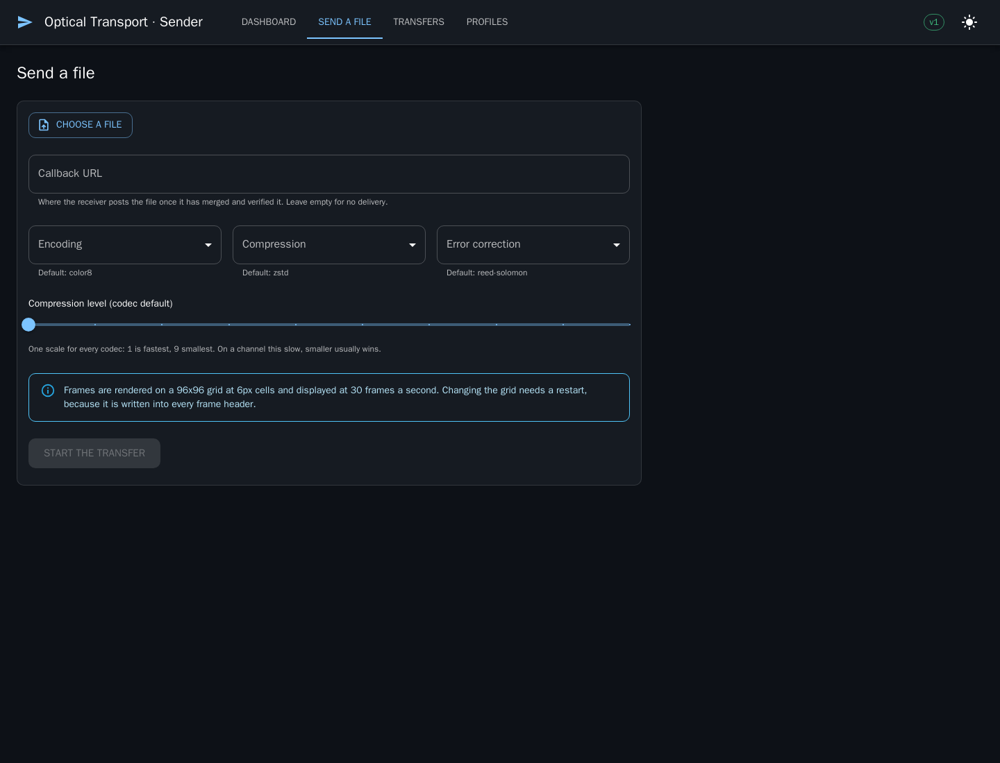

The encoding, compression, and error-correction lists come from the server rather than being
hard-coded in the page, so a build that added an encoding offers it and one that did not cannot be
asked for it. The note at the bottom is the frame geometry in force — it needs a restart to change,
because it is written into every frame header.

The callback URL is worth reading carefully: **the receiver** posts the file there, once it has
reassembled and verified it. The sender never does. The URL travels across the optical channel in
the manifest, because the sender is where a caller supplies it and the receiver is the side that
ends up holding a finished file.

---

## 2 · What actually crosses the gap

The file is compressed, cut into chunks sized so that exactly one chunk fills exactly one frame,
error-coded, and rendered. This is a real frame from the transfer below — 96×96 cells at 6 pixels
each, `color8` encoding, three bits per cell:

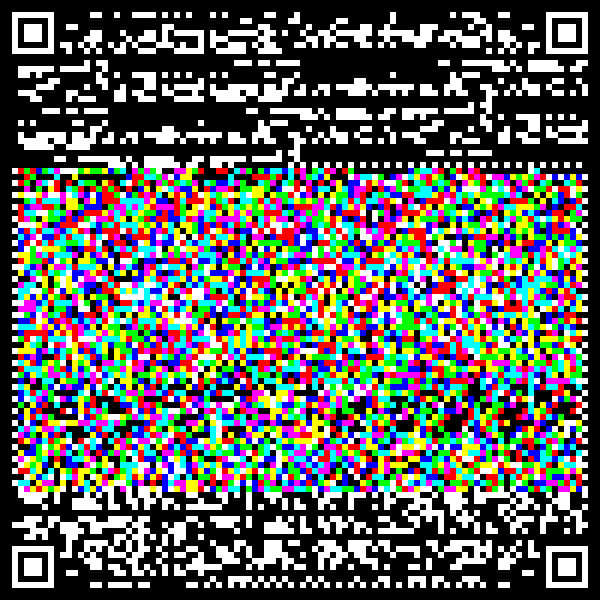

Four corner fiducials, a binary-modulated header band across the top, the colour payload in the
middle, a binary footer band carrying the payload's CRC32 and SHA-256, and timing columns down each
side. The header and footer are always plain black and white whatever the payload modulation is —
that is what lets a receiver read a frame it knows nothing about, learn the geometry and encoding
from it, and only then demodulate the payload.

Frame 0 is the manifest, which is why it looks different: it carries the filename, sizes, the
original SHA-256, the chunk geometry, the error-correction parameters, and the callback URL.

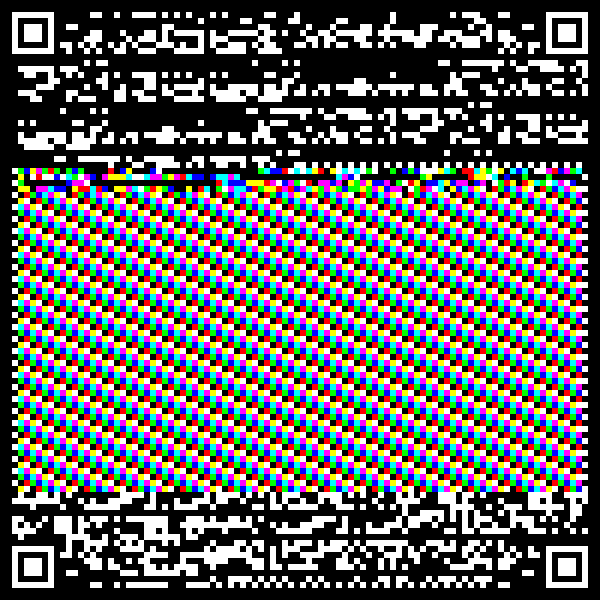

---

## 3 · What the camera sees

The same frame after the simulated optics — this is the image the decoder is actually given:

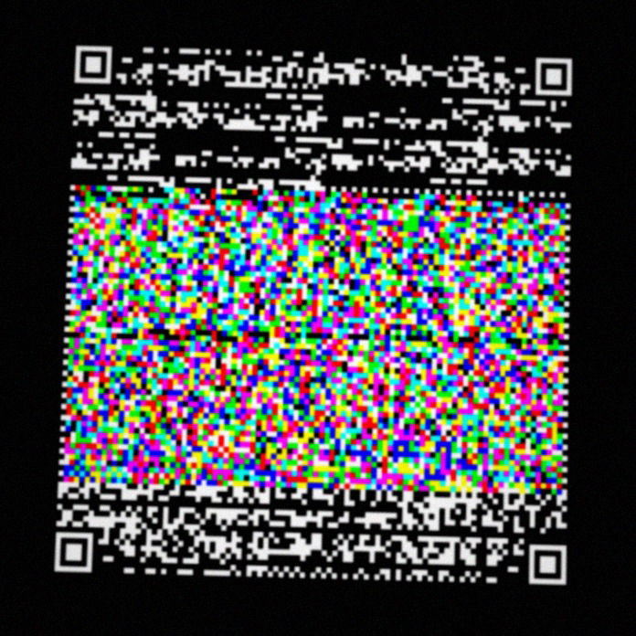

It is 696×696 rather than 600×600 because the frame now occupies part of a larger field of view, as
it would on a sensor. It is rotated a few degrees, softened, noisy, darker at the corners, and
carries compression artefacts. Every frame in this transfer decoded anyway: `frames_failed` was
zero.

That is what the four corner fiducials are for. Four points rather than QR's three supply the
correspondences for a full homography, so a genuinely off-axis view can be corrected rather than
merely tolerated.

---

## 4 · The sender, transferring

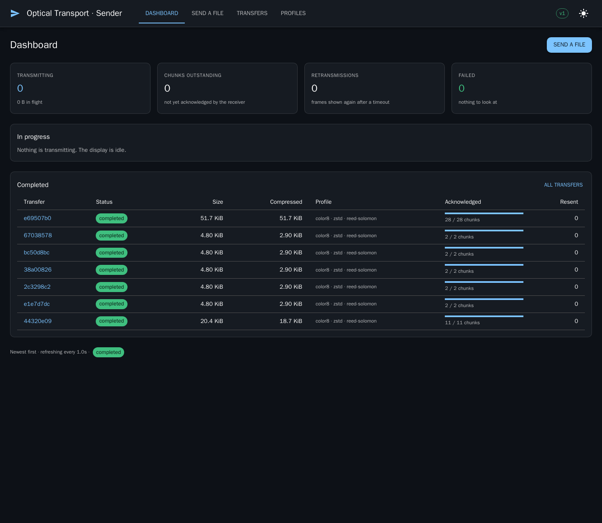

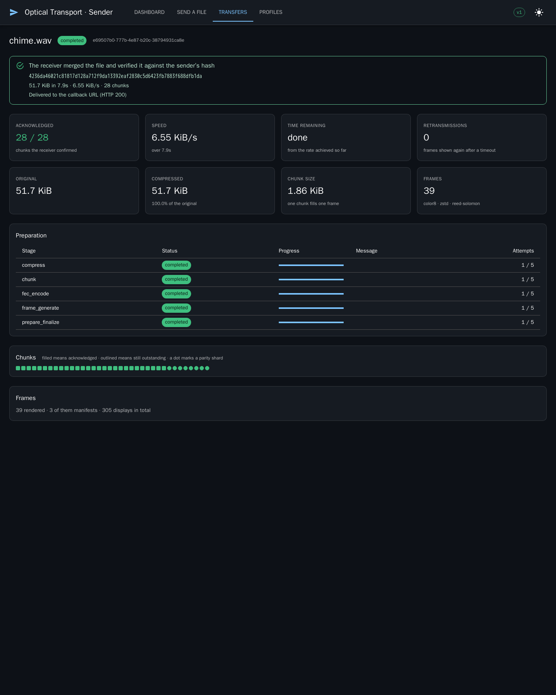

Reading the completed transfer above: 51.7 KiB of audio, 28 chunks, 39 frames rendered (28 chunks +
7 parity shards + 3 manifest re-emissions), **zero retransmissions**, and the receiver's own verdict
at the top — merged, hashed, and matched.

"305 displays in total" for 39 frames is not waste. The display never idles: while a window is
waiting on acknowledgements it repeats the oldest *outstanding* frame, because a camera pointed at a
blank screen learns nothing. What it never does is repeat a frame whose chunk has already been
acknowledged, which is what makes the transfer converge rather than cycle.

The chunk map is the picture worth having during a transfer: filled means acknowledged, outlined
means still outstanding, and a dot marks a parity shard.

---

## 5 · The receiver

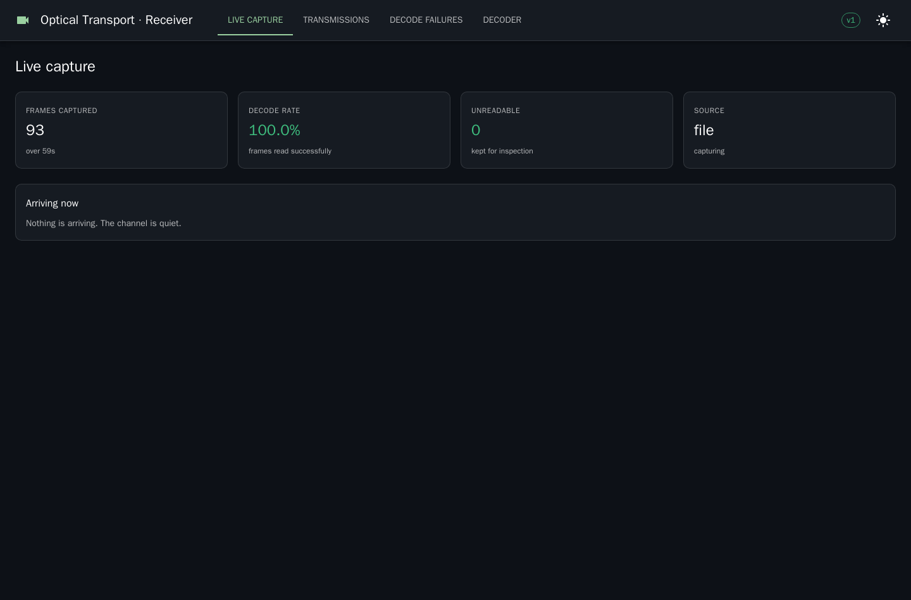

The decode rate is the figure that matters most here. It falls before frames start failing outright,
which makes it the earliest warning that a camera needs attention — sooner than a failure count,
which only moves once things are already going wrong.

---

## 6 · The file, arrived

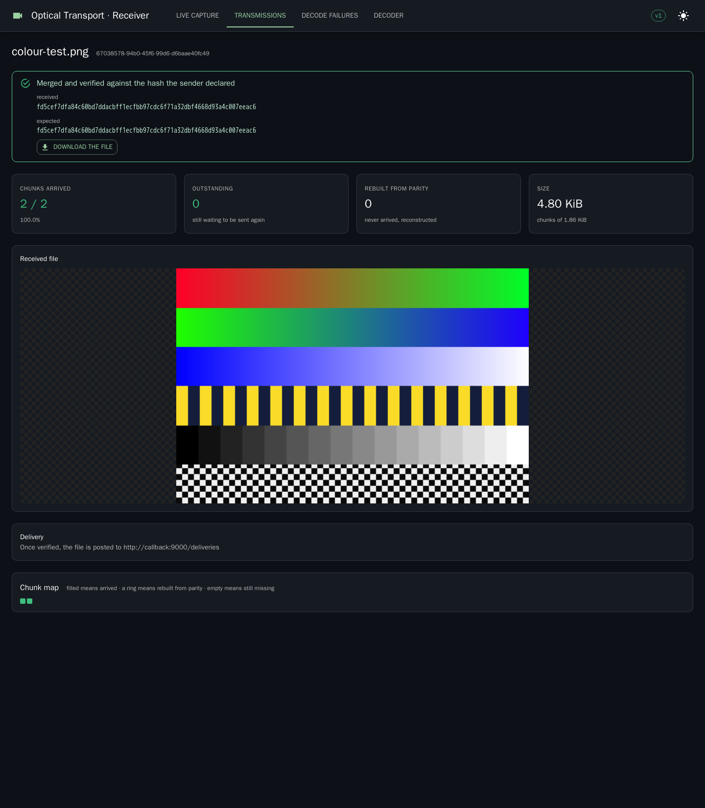

The two hashes are the point of the whole exercise: what the receiver computed over the reassembled
file, and what the sender declared in the manifest. They match, so this is the file that was sent —
not a file that looks like it.

The image is rendered rather than merely reported, because a hash proves a transfer worked while an
image lets an operator recognise the thing they sent. Nothing unverified is ever rendered or served:
a merged file that failed its hash check is kept as evidence and refused on the download endpoint.

Audio arrives the same way and is playable in place:

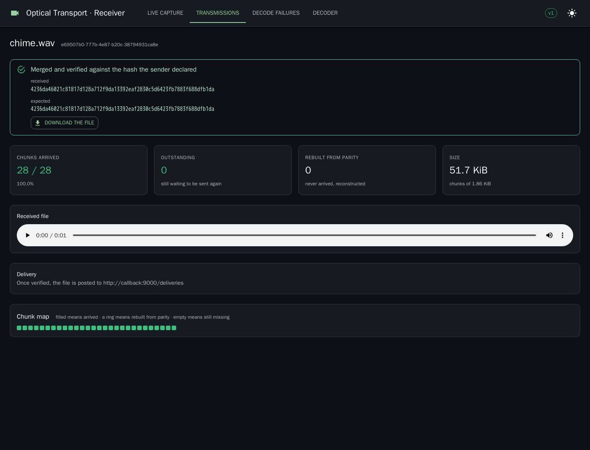

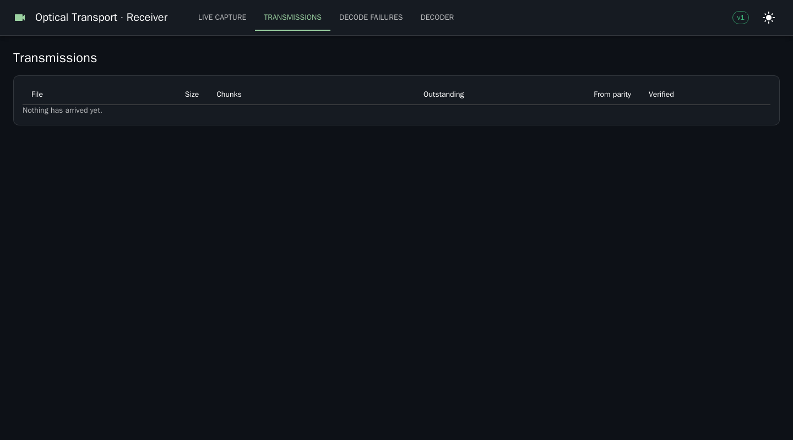

---

## 7 · Delivery to the callback

Once verified, the receiver posts the file to the URL that came across in the manifest. The endpoint
in this demonstration recomputes the hash for itself rather than trusting the header:

```json
{
  "transmission_id": "44320e09-235f-4fb4-9bf7-ece317417060",
  "filename": "colour-test.png",
  "bytes": 20915,
  "declared_sha256": "e7988de79d701069fff4409997c2383fa5d530e7f7e2f58bb69fcb56a6361c96",
  "actual_sha256": "e7988de79d701069fff4409997c2383fa5d530e7f7e2f58bb69fcb56a6361c96",
  "match": true
}
```

The receiver then writes a signed result record back to the shared volume, which is how the sender —
which has no other view of the far side — learns that the transfer worked and that the file was
handed on:

```json
{
  "verified": true,
  "sha256": "4236da46021c81817d128a712f9da13392eaf2830c5d6423fb7883f688dfb1da",
  "chunks_received": 28,
  "chunks_recovered": 0,
  "frames_captured": 34,
  "frames_failed": 0,
  "callback_delivered": true,
  "callback_status": 200
}
```

A receiver will not deliver to any host it is told to. The URL crossed the air gap from outside the
receiver's trust boundary, so delivery is gated by an operator-held allowlist
(`OTP_RECEIVER_CALLBACK_ALLOWED_HOSTS`) and redirects are not followed — a redirect would be the far
side choosing a second destination after the first had been checked. With no allowlist configured,
nothing is delivered anywhere; files still arrive, are verified, and can be downloaded from the UI.

---

---

## 8 · The display, as a camera sees it

The frames are not only files on a volume. `http://localhost:8080/display` is the transmitting end of
the channel as a page, following the display frame by frame:

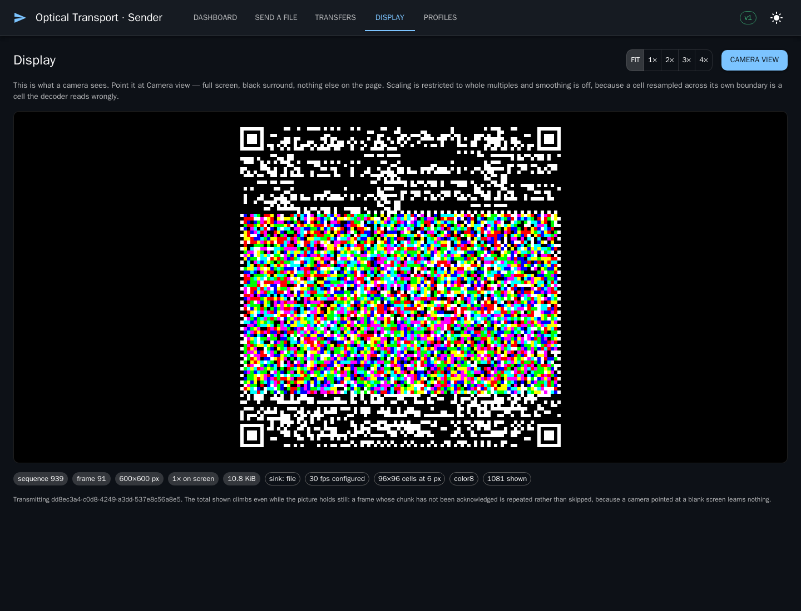

Read the chips along the bottom: display sequence 939, frame 91 of the transmission, 600×600 pixels
shown at 1×, 10.8 KiB of PNG, the `file` sink underneath, 30 fps configured, 96×96 cells at 6 pixels,
`color8`. The last one — 1081 shown — climbs while the picture holds still, which is the display
repeating an unacknowledged frame rather than idling.

`?camera=1` is the same page with everything else removed. This is what the camera is pointed at:

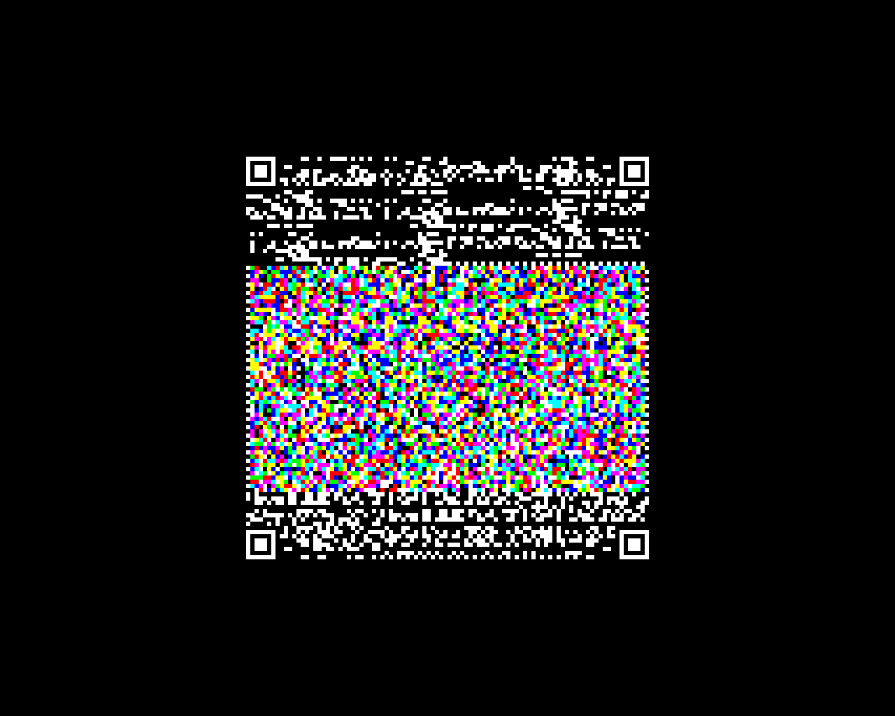

Black surround, no toolbar, no caption, cursor hidden. Every other pixel on the screen would be stray
light the sensor has to expose for, and a frame sharing its exposure with a white toolbar loses contrast
where it needs it most.

Two properties of that page are load-bearing rather than decorative:

- **Scaling is whole multiples only.** A frame is a grid of square cells and the decoder takes the median
  of each cell's pixels. At 1.5× every other cell boundary lands mid-pixel and blends two cells that
  were meant to be distinguished.
- **Smoothing is off** (`image-rendering: pixelated`). The browser's default filter is a blur, and blur
  is precisely what the operating envelope budgets for the lens — spending it here leaves none for the
  optics.

The page follows the display by long-poll rather than polling on a timer, with the frame inlined in the
same response. Measured on the running stack: a request that is already behind returns in 11 ms, and one
that is up to date holds open until either a new frame arrives or the timeout, then answers 204.

---

## 9 · Auditing any frame afterwards

Every frame is kept — the row in Postgres, the PNG in object storage — and served by frame number.
The transfer page shows them all:

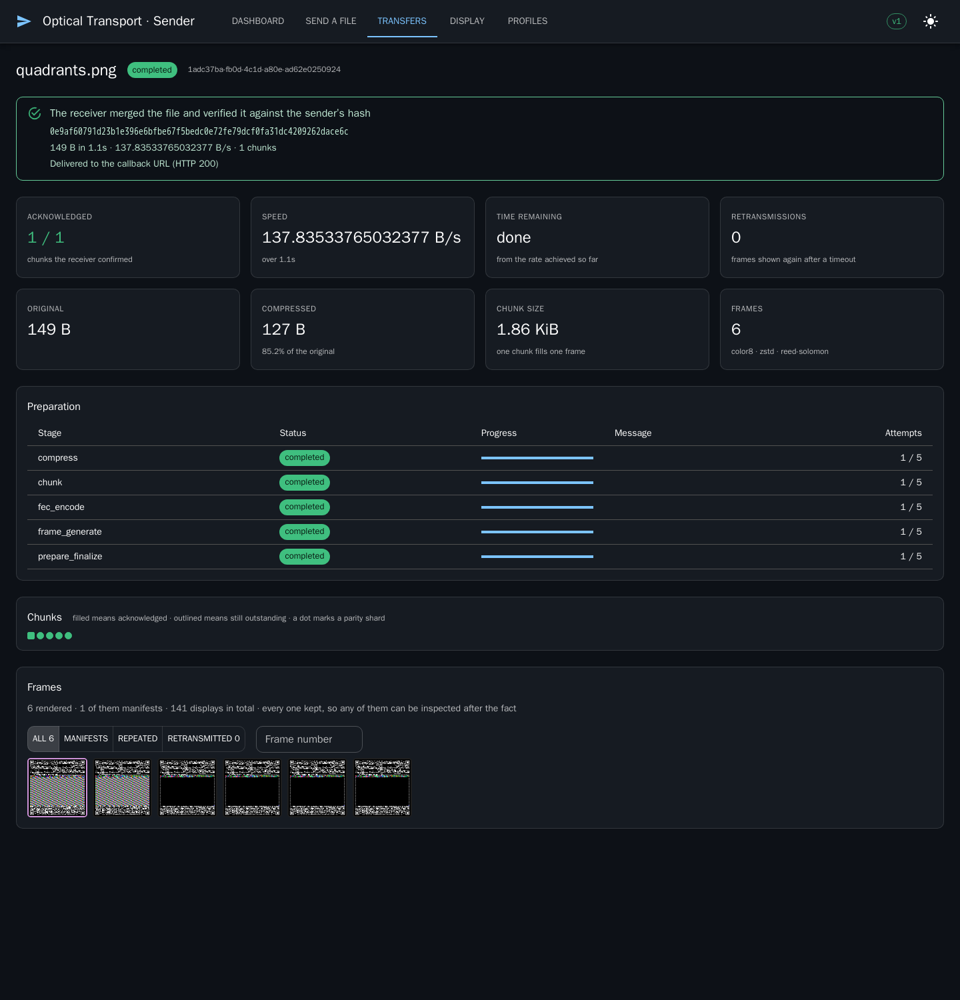

That transfer is 149 bytes in one chunk, so it has six frames: the chunk, its parity, and the manifest
re-emitted. The first two thumbnails carry payload and show colour; the rest are parity and manifest
frames. The border says which kind it is — outlined for an ordinary frame, coloured for a manifest, amber
for one whose chunk needed retransmitting — and the filter buttons above narrow to manifests, frames
displayed more than once, or the ones that were retransmitted.

Clicking a thumbnail opens the exact bytes that went to the channel, at whole-multiple zoom, with the
chunk it carried, whether that chunk was acknowledged, and how many times it had to be sent.

This answers a question no counter can. A chunk that took four attempts was either rendered wrongly or
rendered correctly and photographed badly, and those have different fixes — the stored image decides
which, because it is the same bytes rather than a re-render that might differ.

---

## 10 · Choosing the camera on the receiver

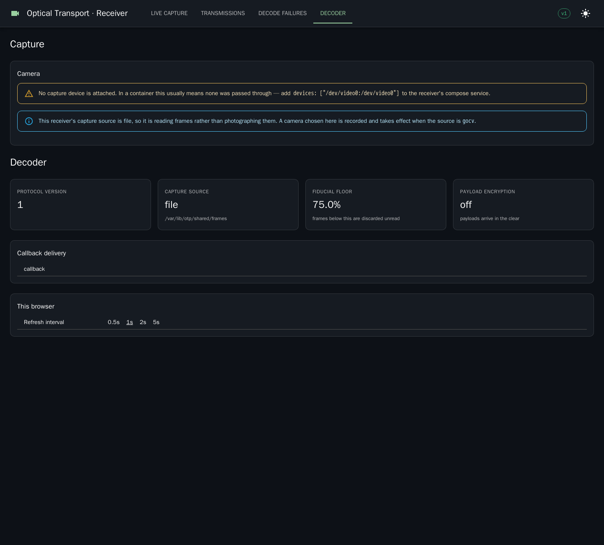

The device list comes from Video4Linux directly, and the filtering is doing real work. On the machine
this was captured on, `/dev/video0` and `/dev/video1` both report "Integrated Camera" — the second is a
metadata node that produces no images. Reading `/sys/class/video4linux/*/name` would have offered both,
and an operator who picked the second would get a receiver that captures nothing and reports it as an
optical fault. Only devices that declare a video capture capability appear.

With nothing configured the default is the lowest-numbered capture device in its largest mode, fastest
breaking the tie. Resolution first, deliberately: cells the camera cannot resolve do not decode at all,
whereas a slow camera only makes the sender wait — which the acknowledgement rule already makes safe.

The receiver in this demonstration has no camera passed through to its container, so it says so, with
the compose line that would fix it — and separately that its capture source is `file`, so it is reading
frames rather than photographing them. Those are two different facts and the page states both, because
"capture is not working" would send an operator looking in the wrong place.

To see the picker populated, pass a device through to the receiver service:

```yaml
    devices:
      - "/dev/video0:/dev/video0"
```

Enumeration was verified against real hardware on the host this was written on, where it found
`/dev/video0` — "Integrated Camera", `uvcvideo`, `usb-0000:00:14.0-6` — with 18 modes, the best being
1920×1080 at 30 fps in MJPG. It also correctly declined to offer `/dev/video1`, which reports the same
card name and is a metadata node that produces no images.

---

## Measured on this run

| | colour-test.png | chime.wav |
|---|---|---|
| Original size | 4 920 B | 52 962 B |
| Compressed | 2 971 B (60%) | 52 962 B (100%, already compact) |
| Chunks | 2 | 28 |
| Frames rendered | 7 | 39 |
| Retransmissions | 0 | 0 |
| Chunks rebuilt from parity | 0 | 0 |
| Frames unreadable | 0 | 0 |
| Verified against sender's hash | yes | yes |
| Callback delivered | yes (HTTP 200) | yes (HTTP 200) |
| Throughput | 6.5 KB/s | 6.55 KiB/s |

The throughput figure is limited by the demonstration rather than by the protocol — see the
[README](../README.md#transfer-speed) for what sets it and what the same code does at other
settings.

## Three defects this demonstration found

Worth recording, because they are the reason a run like this is not optional.

**A verified transfer was reported as failed.** The retry ceiling counted every display of a chunk,
including keep-alive repeats. At thirty frames a second against a two-second acknowledgement poll, a
chunk gets repeated some sixty times before news of its arrival gets back — so the ceiling tripped
on a transfer that was working perfectly. Keep-alives are now excluded from the count: they are the
display filling time, not the sender trying again.

**Progress read 136%.** Parity shards are acknowledged like any other chunk, and the acknowledged
count included them while the total counted only source chunks. Parity is scaffolding that never
appears in the file, so it no longer counts toward how much of the file has arrived.

**A completed transfer went on reporting an outstanding chunk.** Clearing the outstanding list
passed an empty array to SQL, and an empty Go slice arrives as NULL — `chunk_number <> ALL(NULL)` is
NULL rather than true, so the delete matched nothing. Nothing-outstanding is now its own case.
