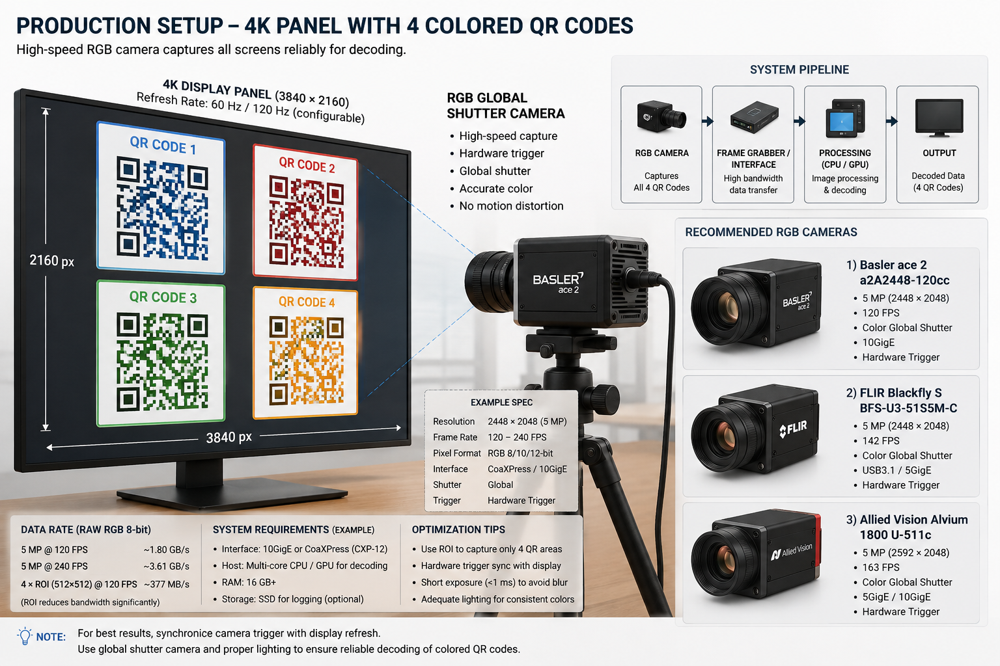

# Production camera setup

The hardware a production installation is specified against, and — more usefully — the arithmetic that
decides whether a given camera can read a given geometry at all.

## Production Camera Setup



The production system uses a **high-speed RGB global-shutter camera** to capture all four multi-colored QR codes displayed simultaneously on a 4K panel.

Each QR code can contain multiple colors, so the camera must capture the **full RGB image** rather than relying on an event-based camera. Event cameras are primarily sensitive to brightness changes and do not provide the complete RGB information required for reliable multi-color QR decoding.

### Production Configuration

| Component | Recommended Configuration |
|---|---|
| Display | 4K (3840 × 2160) |
| Display Refresh | 60 Hz or 120 Hz |
| QR Codes | 4 simultaneous multi-colored QR codes |
| Camera | RGB global-shutter |
| Camera Resolution | ≥ 5 MP recommended |
| Camera FPS | 120 FPS minimum; 240+ FPS preferred |
| Exposure | < 1 ms recommended |
| Trigger | Hardware synchronized with display |
| Interface | 10GigE / CoaXPress |
| Processing | Multi-core CPU / GPU |
| Capture Mode | Full frame or 4 × ROI |
| Lighting | Uniform, flicker-free |

### Recommended Capture Strategy

The camera should operate at a higher frame rate than the display refresh rate. This provides multiple camera opportunities for every display frame and makes synchronization more robust.

| Display | Camera | Frames / Display Frame | QR Sets Captured / Second | Use Case |
|---:|---:|---:|---:|---|
| 60 Hz | 120 FPS | 2 | 60 | Standard |
| 60 Hz | 240 FPS | 4 | 60 | High reliability |
| 120 Hz | 240 FPS | 2 | 120 | Recommended |
| 120 Hz | 480 FPS | 4 | 120 | Maximum reliability |

For example, with a **120 Hz display and 240 FPS camera**, the camera captures approximately two frames during every display refresh period:

```text
Display:       | QR-A | QR-B | QR-C | QR-D |
               8.33ms 8.33ms 8.33ms 8.33ms

Camera:        | F1 | F2 | F3 | F4 | F5 | F6 |
               ~4.17ms per frame
```

### What this platform does with that rig

The specification above is compatible, with one sizing constraint that decides everything and is easy to
miss. The receiver will compute it for you — see **Describing the camera** below — but the short version:

**A 5 MP sensor does not see a 4K panel at 5 MP.** Three factors compound:

| Factor | Effect |
|---|---|
| 16:9 panel inside a 2448 × 2048 sensor | fitted by width: **0.64** camera px per display px |
| Framing margin, so a nudge does not lose a fiducial | × ~0.9 |
| Four lanes tiled 2 × 2 | halves each axis again |

The panel lands on 2448 × 1377 of the sensor — a third of it is looking at the room — and one lane of four
gets 1224 × 688. Against the platform's measured floors of **10 camera pixels per cell for colour** and 6 for
binary, that gives:

| Lanes | Encoding | Largest grid this camera carries |
|---:|---|---:|
| 4 | colour (bit depth 3) | **64** |
| 2 | colour | 118 |
| 1 | colour | 133 |
| 4 | binary | 110 |

So **four colour QR codes work, but only at grid 64 per lane** — the smallest the sender offers, with no
headroom above it. Grid 80 is marginal and 96 does not read at all. Two things follow, and both are worth
deciding before hardware is ordered:

- **Two lanes carry more than four.** Tiling never bought pixels per cell — area is area — so halving the
  lanes roughly doubles the cell size and takes the usable grid from 64 to 118. Four lanes buy *independence*
  (a reflection costs one lane instead of the frame), not capacity. Choose on which of those you need.
- **A higher-resolution sensor moves the ceiling directly.** Everything above scales with sensor width.

Two smaller notes on the diagram itself:

- **The 4 × ROI (512 × 512) figure is too small.** One lane of a 2 × 2 tiling occupies ~1224 × 688 camera
  pixels, so a 512 × 512 ROI crops inside the lane and loses its fiducials. The correct ROIs tile the whole
  frame, which means ROI saves no bandwidth here — budget for the full ~1.8 GB/s at 120 FPS.
- **Pixel format matters more than it looks.** A Bayer format debayered in the camera or the grabber has had
  its colour interpolated from neighbouring photosites. That is the same loss JPEG chroma subsampling
  inflicts, which this project measured at roughly double the ambiguous-cell rate in the marginal band.
  Prefer true RGB8/10/12 output.

### Describing the camera

The receiver has a place to record the production camera and will tell you what it can resolve:

```bash
curl -X PUT localhost:2000/api/v1/capture/rgb -H 'Content-Type: application/json' -d '{
  "enabled": true,
  "model": "Basler ace 2 a2A2448-120cc",
  "sensor_width": 2448, "sensor_height": 2048,
  "fps": 120, "exposure_micros": 800,
  "pixel_format": "RGB8", "interface": "10GigE", "trigger_mode": "hardware",
  "panel_width": 3840, "panel_height": 2160, "panel_fill": 0.9,
  "grid": 64, "bit_depth": 3, "lanes": 4
}'
```

The response carries a `feasibility` object: camera pixels per display pixel, the lane's size on the sensor,
pixels per cell against what the encoding needs, the largest grid this camera can carry, and a sentence
saying what to do about it. `grid`, `bit_depth` and `lanes` are planner inputs — they are not stored, so you
can compare geometries without changing the deployment:

```bash
curl 'localhost:2000/api/v1/capture/rgb?grid=96&bit_depth=3&lanes=2'
```

Every field also has an environment variable (`OTP_RECEIVER_CAPTURE_RGB_*`), which is where to set it for a
deployment that wants it to survive a restart.

**These settings describe the camera; they do not drive it.** This receiver does not open a GigE Vision or
CoaXPress device — those are reached through their vendors' SDKs, and pulling a vendor runtime into this
image would trade "any camera you can script" for "the three we integrated". A production camera feeds this
platform the same way the browser one does: a small grabber process owns the SDK and POSTs each frame to
`/api/v1/capture/frames`. Everything downstream — the lane search, the merge across shots, recovery, the
aiming display — is identical whichever source posted the frame.
